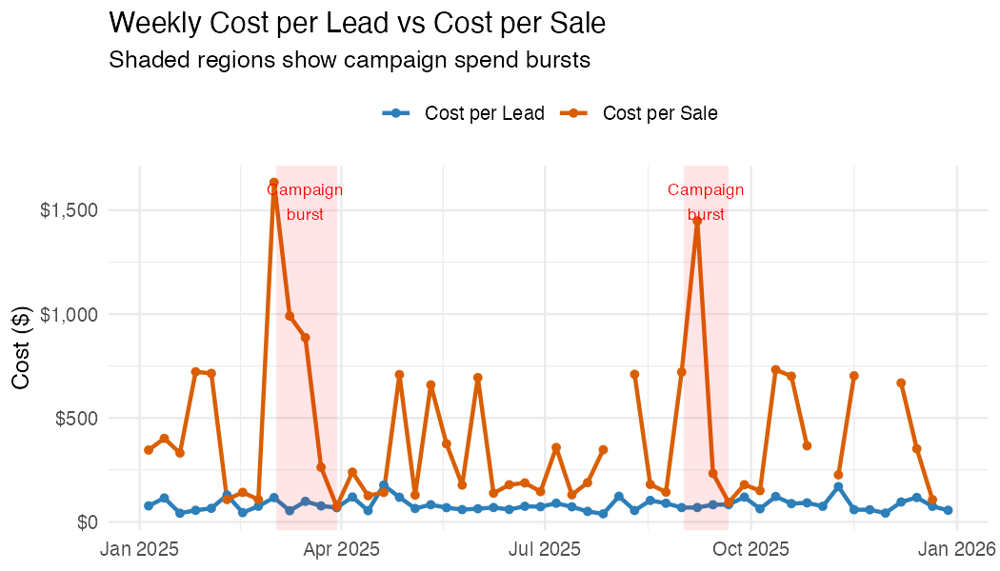
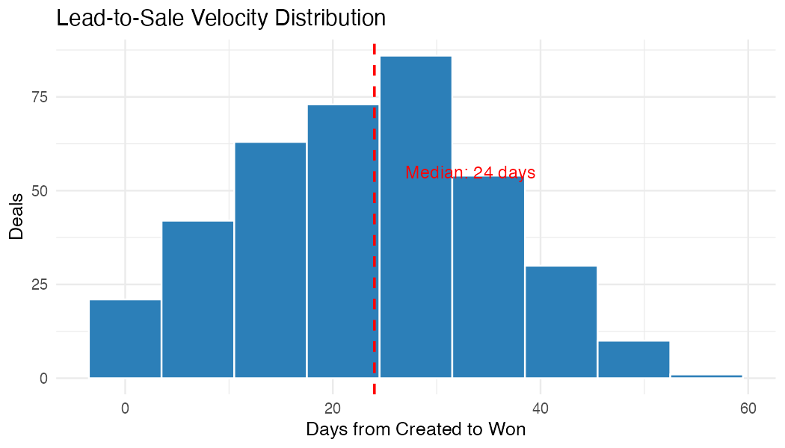
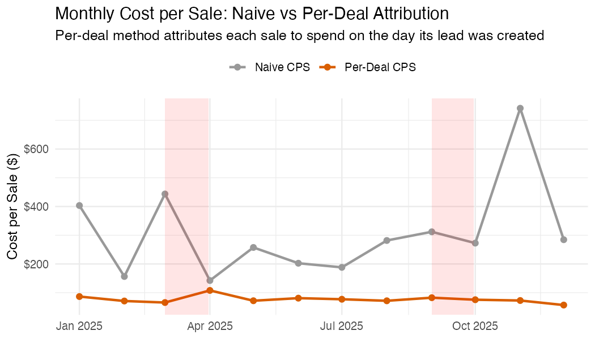
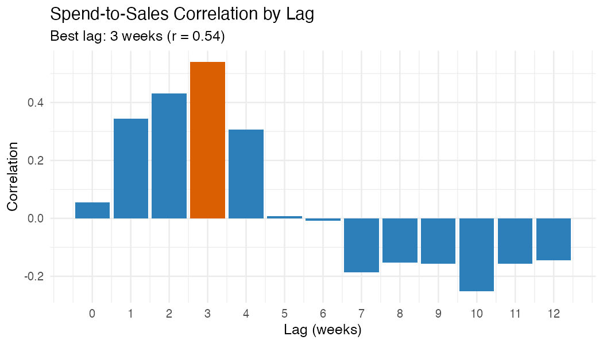

```{r, include = FALSE}
knitr::opts_chunk$set(collapse = TRUE, comment = "#>", eval = FALSE)
```

## Overview

This vignette shows how to combine ActiveCampaign deal data with daily
advertising spend to calculate:

- **Cost per lead (CPL)** — how much you spend to generate one new deal
- **Cost per sale (CPS)** — how much you spend to close one deal
- **Lead-to-sale velocity** — how many days from deal creation to won
- **Windowed attribution** — which week's ad spend drove which week's sales

## Setup

```{r}
library(activecampaignr)
library(dplyr)
library(tidyr)
library(ggplot2)

ac_auth_from_env()
```

## Step 1: Pull Deal Data

```{r}
# Fetch deals — cdate/mdate are already POSIXct, value is already numeric
deals <- ac_deals()

# Select the columns we need
# status is returned as character: "0" = open, "1" = won, "2" = lost
deal_dates <- deals |>
  transmute(
    deal_id = id,
    created = as.Date(cdate),
    closed = as.Date(mdate),
    status = status,
    value = value
  )

# Won deals with velocity
won <- deal_dates |>
  filter(status == "1") |>
  mutate(
    days_to_close = as.integer(closed - created)
  )
```

## Step 2: Prepare Your Ad Spend Data

Create a CSV with your daily advertising spend. The file needs two
columns: `date` and `spend`.

```
date,spend
2025-01-01,150.00
2025-01-02,200.00
2025-01-03,175.50
...
```

You can export this from Google Ads, Meta Ads Manager, or any
platform. If you run multiple channels, either sum them into one
`spend` column or add a `channel` column for per-channel analysis.

```{r}
# Load your spend data
spend <- read.csv("daily_spend.csv") |>
  mutate(date = as.Date(date))
```

## Step 3: Daily Leads and Sales

```{r}
# Count new leads (deals created) per day
daily_leads <- deal_dates |>
  count(date = created, name = "leads")

# Count won deals per day
daily_sales <- won |>
  count(date = closed, name = "sales")

# Revenue per day
daily_revenue <- won |>
  group_by(date = closed) |>
  summarise(revenue = sum(value / 100, na.rm = TRUE), .groups = "drop")

# Combine into one daily table
daily <- spend |>
  full_join(daily_leads, by = "date") |>
  full_join(daily_sales, by = "date") |>
  full_join(daily_revenue, by = "date") |>
  replace_na(list(spend = 0, leads = 0, sales = 0, revenue = 0)) |>
  arrange(date)
```

## Step 4: Cost per Lead and Cost per Sale

### Simple daily metrics

```{r}
daily_metrics <- daily |>
  mutate(
    cpl = if_else(leads > 0, spend / leads, NA_real_),
    cps = if_else(sales > 0, spend / sales, NA_real_),
    roas = if_else(spend > 0, revenue / spend, NA_real_)
  )

daily_metrics |>
  filter(!is.na(cpl)) |>
  summarise(
    median_cpl = median(cpl),
    median_cps = median(cps, na.rm = TRUE),
    median_roas = median(roas, na.rm = TRUE)
  )
```

### Weekly rollup (more stable)

Daily metrics are noisy. Weekly aggregation smooths out day-of-week
effects and small sample sizes.

```{r}
weekly <- daily |>
  mutate(week = floor_date(date, "week")) |>
  group_by(week) |>
  summarise(
    spend = sum(spend),
    leads = sum(leads),
    sales = sum(sales),
    revenue = sum(revenue),
    .groups = "drop"
  ) |>
  mutate(
    cpl = if_else(leads > 0, spend / leads, NA_real_),
    cps = if_else(sales > 0, spend / sales, NA_real_),
    roas = if_else(spend > 0, revenue / spend, NA_real_)
  )

weekly
```

### Plot: Weekly CPL and CPS

```{r fig.width=7, fig.height=4}
weekly |>
  select(week, cpl, cps) |>
  pivot_longer(-week, names_to = "metric", values_to = "cost") |>
  ggplot(aes(week, cost, colour = metric)) +
  geom_line(linewidth = 1) +
  geom_point() +
  scale_y_continuous(labels = scales::dollar) +
  labs(
    title = "Weekly Cost per Lead vs Cost per Sale",
    x = NULL, y = "Cost ($)", colour = NULL
  ) +
  theme_minimal()
```

*Example output (synthetic data):*

```{r, echo=FALSE, eval=TRUE, out.width="100%"}

```

## Step 5: Lead-to-Sale Velocity

Understanding how long it takes to convert a lead to a sale is
critical for windowed attribution. If your average velocity is 3
weeks, then this week's sales were driven by ad spend from 3 weeks ago.

```{r}
# Velocity distribution
velocity_summary <- won |>
  summarise(
    deals = n(),
    median_days = median(days_to_close),
    mean_days = round(mean(days_to_close), 1),
    p25_days = quantile(days_to_close, 0.25),
    p75_days = quantile(days_to_close, 0.75)
  )

velocity_summary
```

```{r fig.width=7, fig.height=4}
ggplot(won, aes(days_to_close)) +
  geom_histogram(binwidth = 7, fill = "#2c7fb8", colour = "white") +
  geom_vline(
    xintercept = median(won$days_to_close),
    linetype = "dashed", colour = "red"
  ) +
  labs(
    title = "Lead-to-Sale Velocity Distribution",
    subtitle = paste("Median:", median(won$days_to_close), "days"),
    x = "Days from Created to Won", y = "Deals"
  ) +
  theme_minimal()
```

*Example output (synthetic data):*

```{r, echo=FALSE, eval=TRUE, out.width="100%"}

```

## Step 6a: Windowed Attribution (Aggregate)

Naive CPS divides this week's spend by this week's sales. But if your
median velocity is 3 weeks, this week's sales were actually driven by
spend from 3 weeks ago. This matters when spend varies over time.

Consider a campaign burst: you double your ad budget in March. Naive
CPS spikes in March (high spend, same number of sales closing).
Windowed CPS stays flat in March but spikes 3 weeks later, when the
leads generated by that burst actually close. This gives you a more
accurate picture of what each sale really cost.

If your spend is steady week-to-week, the two lines will overlap
because `lag(spend, 3)` ≈ `spend`. The divergence only appears when
spend has meaningful variation (campaign bursts, budget changes,
seasonal ramps).

```{r}
lag_weeks <- round(median(won$days_to_close) / 7)

windowed <- weekly |>
  mutate(
    # Shift spend back by the median velocity
    lagged_spend = lag(spend, n = lag_weeks),
    # Windowed CPS: this week's sales attributed to spend N weeks ago
    windowed_cps = if_else(
      sales > 0 & !is.na(lagged_spend),
      lagged_spend / sales,
      NA_real_
    ),
    windowed_roas = if_else(
      !is.na(lagged_spend) & lagged_spend > 0,
      revenue / lagged_spend,
      NA_real_
    )
  )
```

### Compare naive vs windowed

```{r fig.width=7, fig.height=4}
windowed |>
  select(week, naive_cps = cps, windowed_cps) |>
  pivot_longer(-week, names_to = "method", values_to = "cost") |>
  ggplot(aes(week, cost, colour = method)) +
  geom_line(linewidth = 1) +
  geom_point() +
  scale_y_continuous(labels = scales::dollar) +
  labs(
    title = paste0(
      "Cost per Sale: Naive vs Windowed (", lag_weeks, "-week lag)"
    ),
    x = NULL, y = "Cost per Sale ($)", colour = NULL
  ) +
  theme_minimal()
```

*Example output (synthetic data with campaign bursts in March and September):*

```{r, echo=FALSE, eval=TRUE, out.width="100%"}
knitr::include_graphics("figures/naive_vs_windowed.png")
```

## Step 6b: Per-Deal Attribution

The windowed approach above is an aggregate approximation. For more
precise attribution, work at the deal level: for each won deal, look
up the ad spend on the day that deal was *created*, then divide by
the number of leads created that same day. This gives each deal its
own attributed acquisition cost.

```
Deal 1042: created 10 Mar, closed 2 Apr (23 days)
  Ad spend on 10 Mar: $280
  Leads created on 10 Mar: 4
  → Attributed cost for deal 1042: $280 / 4 = $70
```

This method handles uneven spend naturally. A deal created during a
campaign burst gets a higher attributed cost than one created on a
quiet day, regardless of when it closes.

```{r}
# For each won deal, look up spend on the day it was created
won_attributed <- won |>
  left_join(
    daily |> select(date, daily_spend = spend, daily_leads = leads),
    by = c("created" = "date")
  ) |>
  mutate(
    # This deal's share of that day's spend
    attributed_cost = if_else(
      daily_leads > 0,
      daily_spend / daily_leads,
      NA_real_
    )
  )

# Summary: what did each sale actually cost to acquire?
won_attributed |>
  filter(!is.na(attributed_cost)) |>
  summarise(
    deals = n(),
    median_cost = median(attributed_cost),
    mean_cost = mean(attributed_cost),
    p25 = quantile(attributed_cost, 0.25),
    p75 = quantile(attributed_cost, 0.75)
  )
```

### Compare naive vs per-deal CPS over time

```{r fig.width=7, fig.height=4}
# Monthly comparison
monthly_attributed <- won_attributed |>
  mutate(month = floor_date(closed, "month")) |>
  group_by(month) |>
  summarise(
    avg_attributed_cps = mean(attributed_cost, na.rm = TRUE),
    .groups = "drop"
  )

monthly_naive <- daily |>
  mutate(month = floor_date(date, "month")) |>
  group_by(month) |>
  summarise(spend = sum(spend), sales = sum(sales), .groups = "drop") |>
  mutate(naive_cps = if_else(sales > 0, spend / sales, NA_real_))

monthly_attributed |>
  left_join(monthly_naive |> select(month, naive_cps), by = "month") |>
  select(month, `Naive CPS` = naive_cps, `Per-Deal CPS` = avg_attributed_cps) |>
  pivot_longer(-month, names_to = "method", values_to = "cost") |>
  ggplot(aes(month, cost, colour = method)) +
  geom_line(linewidth = 1) +
  geom_point(size = 2) +
  scale_y_continuous(labels = scales::dollar) +
  labs(
    title = "Monthly Cost per Sale: Naive vs Per-Deal Attribution",
    subtitle = "Per-deal attributes each sale to spend on the day its lead was created",
    x = NULL, y = "Cost per Sale ($)", colour = NULL
  ) +
  theme_minimal()
```

*Example output (synthetic data with campaign bursts in March and September):*

```{r, echo=FALSE, eval=TRUE, out.width="100%"}

```

### Which method to use?

| Method | Pros | Cons |
|---|---|---|
| Naive (same-period) | Simple, no assumptions | Conflates cause and effect |
| Windowed (lagged) | Accounts for velocity | Uses median lag for all deals; loses deal-level detail |
| Per-deal attribution | Most accurate; handles variable spend and velocity | Requires deal-level created dates; assumes all leads come from paid ads |

For most teams, start with per-deal attribution. Fall back to windowed
if you don't have reliable deal creation dates.

## Step 7: Spend-to-Sales Correlation

Test which lag window produces the strongest correlation between
spend and sales. This helps validate your assumed velocity.

```{r}
# Test lags from 0 to 12 weeks
lag_test <- tibble(lag_weeks = 0:12) |>
  rowwise() |>
  mutate(
    correlation = cor(
      weekly$spend[1:(nrow(weekly) - lag_weeks)],
      weekly$sales[(1 + lag_weeks):nrow(weekly)],
      use = "complete.obs"
    )
  ) |>
  ungroup()

best_lag <- lag_test |> slice_max(correlation, n = 1)
```

```{r fig.width=7, fig.height=4}
ggplot(lag_test, aes(lag_weeks, correlation)) +
  geom_col(fill = "#2c7fb8") +
  geom_col(
    data = best_lag,
    fill = "#d95f02"
  ) +
  labs(
    title = "Spend-to-Sales Correlation by Lag",
    subtitle = paste0(
      "Best lag: ", best_lag$lag_weeks,
      " weeks (r = ", round(best_lag$correlation, 2), ")"
    ),
    x = "Lag (weeks)", y = "Correlation"
  ) +
  theme_minimal()
```

*Example output (synthetic data):*

```{r, echo=FALSE, eval=TRUE, out.width="100%"}

```

## Step 8: Summary Table

```{r}
summary_table <- tibble(
  metric = c(
    "Total ad spend",
    "Total leads generated",
    "Total sales closed",
    "Total revenue",
    "Cost per lead (CPL)",
    "Cost per sale (CPS)",
    "Return on ad spend (ROAS)",
    "Median lead-to-sale velocity",
    "Best spend-to-sale lag"
  ),
  value = c(
    scales::dollar(sum(daily$spend)),
    format(sum(daily$leads), big.mark = ","),
    format(sum(daily$sales), big.mark = ","),
    scales::dollar(sum(daily$revenue)),
    scales::dollar(sum(daily$spend) / max(sum(daily$leads), 1)),
    scales::dollar(sum(daily$spend) / max(sum(daily$sales), 1)),
    paste0(round(sum(daily$revenue) / max(sum(daily$spend), 1), 1), "x"),
    paste(median(won$days_to_close), "days"),
    paste(best_lag$lag_weeks, "weeks")
  )
)

summary_table
```

## Adapting This Analysis

### Multiple ad channels

If your spend CSV includes a `channel` column (e.g., Google, Meta,
LinkedIn), group by channel throughout:

```{r}
weekly_by_channel <- daily |>
  mutate(week = floor_date(date, "week")) |>
  group_by(week, channel) |>
  summarise(across(c(spend, leads, sales, revenue), sum), .groups = "drop")
```

### Pipeline-specific analysis

Filter deals by pipeline to analyse specific products:

```{r}
# Only deals from pipeline "1" (e.g., your main sales pipeline)
deals <- ac_deals(pipeline = "1")
```

### Using deal won dates from activity logs

AC's `mdate` is the last-modified date, not necessarily the won date.
For more accurate velocity, use `ac_deal_won_dates()` to extract
the actual status-change timestamp from deal activity logs:

```{r}
won_dates <- ac_deal_won_dates(won$deal_id)
won <- won |>
  left_join(won_dates, by = c("deal_id" = "deal_id")) |>
  mutate(
    closed = coalesce(as.Date(won_date), closed),
    days_to_close = as.integer(closed - created)
  )
```
