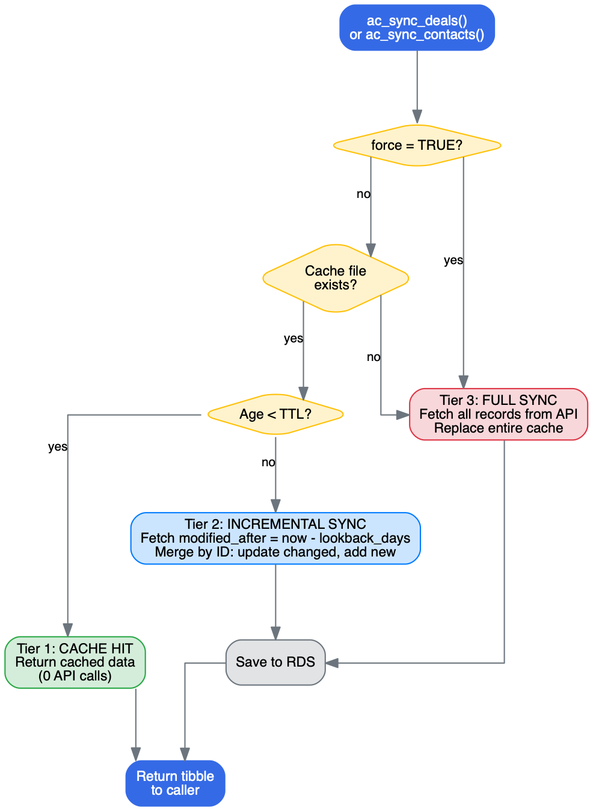

```{r, include = FALSE}
knitr::opts_chunk$set(collapse = TRUE, comment = "#>", eval = FALSE)
```

## Why Cache?

ActiveCampaign's API rate limit is 5 requests per second. A CRM with
2,000 deals requires 20 paginated requests just to list them. If your
analysis script runs multiple times a day, or you're iterating on a
report, those redundant API calls add up fast:

| Scenario | Without cache | With cache |
|---|---|---|
| First run (2,000 deals + custom fields) | ~40 API calls, ~12 sec | Same (cache is cold) |
| Second run 5 minutes later | ~40 API calls, ~12 sec | 0 API calls, <0.1 sec |
| Third run 15 minutes later | ~40 API calls, ~12 sec | ~4 API calls, ~2 sec (incremental) |
| Script crash mid-analysis, re-run | ~40 API calls, ~12 sec | 0 API calls, <0.1 sec |

The cache is especially valuable during development when you're
re-running `source("analysis.R")` repeatedly.

## How It Works

activecampaignr uses a three-tier strategy:

```{r, echo = FALSE, eval = TRUE, out.width = "100%", fig.alt = "Caching flow diagram showing three tiers: cache hit, incremental sync, and full sync"}

```

| Tier | Condition | Action | API calls |
|---|---|---|---|
| 1. Cache hit | Cache file exists and age < TTL | Return cached data | 0 |
| 2. Incremental sync | Cache exists but stale | Fetch records modified in last N days, merge by ID | Few |
| 3. Full sync | No cache file, or `force = TRUE` | Fetch everything from the API | All |

### Basic Usage

```{r}
library(activecampaignr)
ac_auth_from_env()

# The sync function handles the strategy automatically
result <- ac_sync_deals(
  lookback_days = 5,           # Tier 2: how far back to check
  ttl_minutes = 10,            # Tier 1: cache freshness threshold
  force = FALSE,               # Set TRUE to skip straight to Tier 3
  include_custom_fields = TRUE # Also cache custom fields
)

deals <- result$deals
custom_fields <- result$custom_fields
```

### Merge Strategy

When performing incremental sync, the merge works by ID:

```
Stored:  [A v1, B v1, C v1]   (1,000 records from last full sync)
Fetched: [B v2, D v1]         (2 records changed in last 5 days)
Result:  [A v1, B v2, C v1, D v1]  (1,001 records)
```

- Record B was updated: old version replaced with new
- Record D is new: appended
- Record A and C were unchanged: kept as-is

This means incremental sync fetches 2 records instead of 1,001,
saving ~10 seconds and ~19 API calls.

## Cache Storage

Cache files are standard R RDS files stored in a single directory.

```{r}
# Default location
ac_cache_path()
# "~/.activecampaignr/cache"

# Change it (e.g., project-local cache)
ac_cache_path("~/my-project/.cache")

# Or set at auth time
ac_auth_from_env(cache_dir = "~/my-project/.cache")
```

### Inspecting the Cache

```{r}
ac_cache_status()
# # A tibble: 3 x 5
#   key                  rows age_minutes size_kb path
#   <chr>               <int>       <dbl>   <dbl> <chr>
# 1 contacts             2340       15.2    450.1 ~/.activecampaignr/cache/contacts.rds
# 2 deal_custom_fields    890        5.3    120.5 ~/.activecampaignr/cache/deal_custom_fields.rds
# 3 deals                 890        5.3    280.8 ~/.activecampaignr/cache/deals.rds
```

You can also read cache files directly if needed:

```{r}
# Read a cache file manually
deals <- readRDS("~/.activecampaignr/cache/deals.rds")
```

## Flushing the Cache

### Clear everything

```{r}
ac_cache_clear()
# i Removed 3 cached files
```

### Clear a specific entity

```{r}
ac_cache_clear("deals")           # Just deals
ac_cache_clear("deal_custom_fields")  # Just custom fields
ac_cache_clear("contacts")        # Just contacts
```

### Force a fresh sync

Instead of clearing and re-fetching separately, use `force = TRUE`:

```{r}
# Equivalent to: clear + full sync in one step
result <- ac_sync_deals(force = TRUE)
```

### Nuclear option: delete the cache directory

```{r}
unlink(ac_cache_path(), recursive = TRUE)
```

## When to Flush

| Situation | Action |
|---|---|
| New custom fields added in AC | `ac_cache_clear("deal_custom_fields")` |
| Deals moved/deleted in bulk via AC UI | `ac_sync_deals(force = TRUE)` |
| Switching between AC accounts | `ac_cache_clear()` then re-auth |
| Cache seems corrupt or stale | `ac_cache_clear()` |
| Routine analysis re-runs | Do nothing (cache handles it) |

## Gotchas

### Deleted records stay in cache

ActiveCampaign's `updated_after` filter returns modified records, but
it does not tell you about deleted records. If a deal is deleted in AC,
incremental sync won't remove it from your cached data.

**Fix:** Run a full sync periodically (e.g., daily):

```{r}
# Weekly full refresh in a scheduled script
ac_sync_deals(force = TRUE)
```

### TTL is per-file, not per-session

The TTL is based on the cache file's last-modified time on disk, not
when you started your R session. If another script updates the cache
file, your session will pick up that data on the next sync call.

### Custom fields are not incrementally synced

`ac_sync_deals(include_custom_fields = TRUE)` re-fetches all custom
field values on every non-cache-hit call. The AC API does not support
`updated_after` filtering on custom field values, so incremental sync
is not possible for them.

For large accounts, custom field fetching is the slowest part. If you
only need deal metadata (no custom fields), set
`include_custom_fields = FALSE`:

```{r}
result <- ac_sync_deals(include_custom_fields = FALSE)
```

### Cache is not shared across machines

The cache is local to the machine and user. If you run the same
pipeline on CI or a different laptop, it starts with a cold cache.
Consider committing a seed cache file to your project repo if cold
start time matters.

### Multiple AC accounts

The cache directory is shared by default. If you switch between AC
accounts, flush the cache first:

```{r}
# Switch accounts safely
ac_cache_clear()
ac_auth(url = "https://other-account.api-us1.com", api_key = "...")
```

Or use separate cache directories per account:

```{r}
ac_auth(url = "https://account-a.api-us1.com", api_key = "...",
        cache_dir = "~/.activecampaignr/cache-a")

ac_auth(url = "https://account-b.api-us1.com", api_key = "...",
        cache_dir = "~/.activecampaignr/cache-b")
```

## The `ac_cache()` Helper

For custom caching scenarios, use the low-level `ac_cache()` function:

```{r}
# Cache any expensive computation
pipelines <- ac_cache("pipelines", function() {
  ac_deal_pipelines()
}, ttl_minutes = 60)  # Pipelines rarely change

# Force refresh
pipelines <- ac_cache("pipelines", function() {
  ac_deal_pipelines()
}, force = TRUE)
```

## Parallel Sync with future

For production pipelines, sync deals and contacts in parallel:

```{r}
library(future)
plan(multisession, workers = 2)

library(progressr)
handlers(global = TRUE)

with_progress({
  p <- progressor(steps = 10)

  f_deals <- future({
    ac_sync_deals(.progress = p)
  }, seed = TRUE)

  f_contacts <- future({
    ac_sync_contacts(.progress = p)
  }, seed = TRUE)

  deals_result <- value(f_deals)
  contacts <- value(f_contacts)
})

plan(sequential)
```

## Recommended Production Pattern

```{r}
library(activecampaignr)
ac_auth_from_env(cache_dir = "data/cache")

# Daily scheduled script
result <- ac_sync_deals(
  lookback_days = 7,    # Generous lookback covers weekends
  ttl_minutes = 0,      # Always do at least incremental
  force = FALSE
)
contacts <- ac_sync_contacts(lookback_days = 7, ttl_minutes = 0)

# Weekly: force full refresh to catch deletions
if (weekdays(Sys.Date()) == "Monday") {
  result <- ac_sync_deals(force = TRUE)
  contacts <- ac_sync_contacts(force = TRUE)
}

# Analyse
deals <- ac_deals_full()
```
